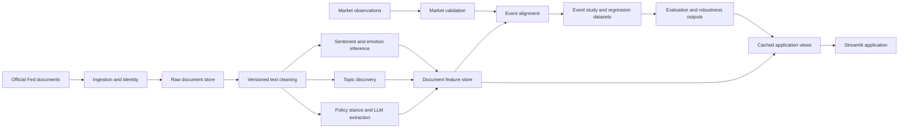

# Phase 2 architecture

## Objective

The project will turn the audited notebook into a reproducible research pipeline and an interactive policy-intelligence application. The architecture keeps source acquisition, validation, NLP inference, event construction, statistical analysis, and presentation separate so each result can be traced to inputs and configuration.

Phase 2 creates only the shared foundations required by later phases: package metadata, validated settings, structured logging, environment defaults, and tests for those components. It does not claim that the data, NLP, analysis, LLM, or application layers are implemented.

## Design principles

1. Preserve source records and raw text. Cleaning creates new versioned fields rather than overwriting inputs.
2. Treat a document, an announcement event, and a market observation as different entities.
3. Require an explicit tokenizer for every model call.
4. Save full probability distributions and inference metadata, not only winning labels.
5. Make exclusions, deduplication decisions, joins, and event alignment observable through count reports.
6. Use cached intermediate outputs so CPU workflows do not rerun models unnecessarily.
7. Keep a mock LLM path as the default until a provider is selected and evaluated.
8. Add modules only when their behavior and tests are implemented.

## Target data flow

## Package boundaries

The intended package is `fed_policy_intelligence`. Only implemented modules are created in the repository.

| Area | Responsibility | Phase 2 status |
|---|---|---|
| `settings.py` | Load and validate YAML settings, resolve paths, apply narrow environment overrides | Implemented |
| `logging_config.py` | Configure consistent JSON or human-readable process logs | Implemented |
| `data/identity.py` | Canonical URLs, document IDs, content hashes, duplicate decisions | Deferred to the data-pipeline phase |
| `data/preprocessing.py` | Versioned text cleaning with removal diagnostics | Deferred |
| `data/market.py` | Market provider interface, validation, and trading calendar | Deferred |
| `nlp/chunking.py` | Tokenizer-explicit long-document chunking and aggregation | Deferred |
| `nlp/sentiment.py` | FinBERT inference with full probabilities and metadata | Deferred |
| `nlp/emotion.py` | Emotion inference with its paired tokenizer and complete label space | Deferred |
| `nlp/topics.py` | LDA baseline and later embedding-model comparison | Deferred |
| `nlp/policy.py` | Transparent and LLM-assisted policy stance extraction | Deferred |
| `analysis/events.py` | Announcement-to-session alignment and event windows | Deferred |
| `analysis/regression.py` | Explicit baseline/enhanced models and diagnostics | Deferred |
| `evaluation/` | Annotation data, metrics, error analysis, and evidence checks | Deferred |
| `app/` | Streamlit views backed by cached outputs | Deferred |

This phased creation policy prevents empty modules and documentation that implies unfinished features are available.

## Core data contracts

Later phases should implement and version these logical records. Storage may begin as validated tabular files and evolve only if a demonstrated need exists.

### Document record

| Field | Purpose |
|---|---|
| `document_id` | Stable project identifier derived from canonical source identity |
| `canonical_url` | Normalized official source URL |
| `content_sha256` | Exact-content identity and audit evidence |
| `document_type` | Statement, transcript, minutes, implementation note, speech, or other |
| `publication_date` | Source publication date |
| `publication_timestamp` | Timezone-aware timestamp when verified; otherwise null |
| `timing_precision` | Timestamp, date-only, or unknown |
| `raw_text` | Immutable extracted source text |
| `cleaned_text` | Text created by a named preprocessing version |
| `retrieved_at` | Source retrieval timestamp |
| `processing_version` | Code/config version used for the derived record |

### Prediction record

Every prediction links to `document_id` and records model identifier/revision, tokenizer identifier, preprocessing version, chunking configuration, aggregation method, full class probabilities, derived score, run timestamp, and runtime device.

### Market observation

Market data remains separate from documents and records instrument/series, provider, trading date, timestamp when available, raw level, derived change or return, retrieval date, and transformation version.

### Event record

An event links one or more documents to a documented trading session. It records the alignment rule, timing precision, ambiguity flag, overlapping-event information, and predefined outcome windows. Same-date documents are never silently discarded.

### LLM extraction record

The later LLM phase will store schema version, provider/model, prompt version, source passage identity, structured fields, verbatim evidence, evidence-verification results, abstentions, errors, and generation metadata. Mock responses remain available for offline tests.

## Configuration strategy

`config/config.yaml` is the versioned default. Environment variables are restricted to machine/runtime selections:

- `FPI_CONFIG_PATH`
- `FPI_DEVICE`
- `FPI_LOG_LEVEL`
- `FPI_LLM_PROVIDER`

The default device is `cpu` and the default LLM provider is `mock`. Colab can set `FPI_DEVICE=cuda` after GPU dependencies and compatibility are verified. Credentials are intentionally absent in Phase 2 and will be introduced only with an implemented provider integration.

## Dependency strategy

`pyproject.toml` is the single dependency source. Phase 2 declares only PyYAML and development tools needed by the implemented scaffold. Pandas, Transformers, PyTorch, statsmodels, Streamlit, topic-modeling libraries, market calendars, and provider SDKs will be added in the phase that introduces tested code using them. This avoids claiming untested compatibility.

## Local and Colab execution

- Local development targets Python 3.11 or 3.12 and CPU by default.
- Model inference will use configurable batches and persistent caches suitable for a small CPU demonstration.
- Colab will use the same package and configuration, changing only device and storage paths where necessary.
- Generated data, caches, weights, and credentials are excluded from Git.

## Delivery sequence after Phase 2

1. Implement document identity, validation, and safe preprocessing for the existing corpus.
2. Implement market-data validation while preserving the existing VIX source.
3. Implement tokenizer-safe sentiment and emotion inference with cached outputs.
4. Rebuild topic discovery and evaluation.
5. Implement event alignment, outcomes, baseline models, and robustness checks.
6. Implement mock-first structured policy extraction, then select a live provider.
7. Build the Streamlit application from cached, validated outputs.

Each step adds its own modules and tests. No later layer should import notebook state or depend on a previous interactive cell execution.

